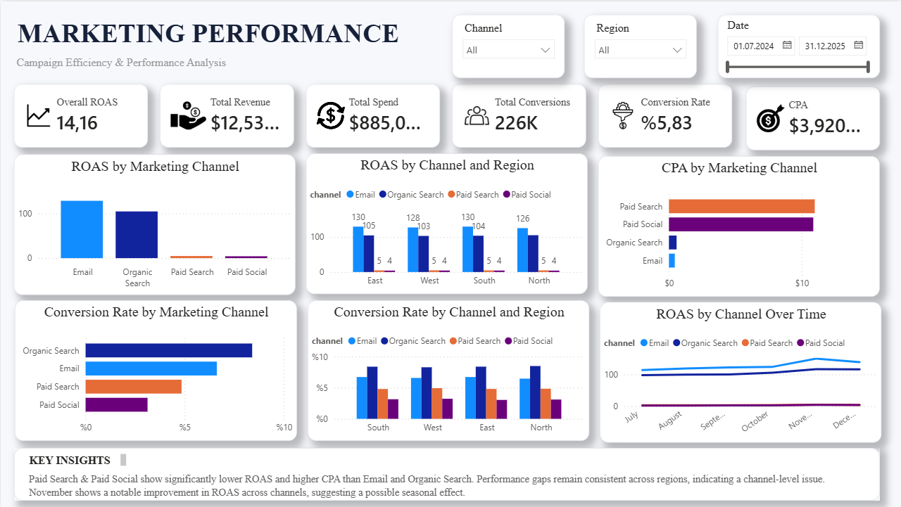

# Marketing Campaign Performance Analysis

## Project Overview

This project analyzes marketing campaign performance across different channels, regions, and time periods using the `marketing_events` dataset.

The analysis evaluates campaign effectiveness using key metrics such as **Revenue, Conversions, Conversion Rate, ROAS, and CPA**, and translates the findings into actionable business recommendations.

## Business Question

**How effective are the marketing campaigns, and how has their performance changed over time?**

## Tools & Technologies

- **Python & Pandas** — data loading and database preparation
- **SQLite** — data storage and querying
- **SQL** — data aggregation and root-cause analysis
- **DB Browser for SQLite** — SQL analysis
- **Power BI** — dashboard and data visualization
- **Excel** — source dataset

## Project Workflow

### 1. KPI Definition

Four core KPIs were defined to evaluate marketing performance:

- **Conversion Rate** — Conversions / Sessions × 100
- **Revenue** — Total revenue generated
- **ROAS** — Revenue / Spend
- **Conversions** — Total number of conversions

### 2. SQL Data Analysis

The marketing data was aggregated and analyzed by:

- Marketing channel
- Region
- Month
- Channel and region
- Channel and month

Additional metrics, including **CPA (Spend / Conversions)**, were calculated to evaluate acquisition efficiency.

### 3. Root-Cause Analysis

The analysis identified a significant performance gap between marketing channels.

**Email** and **Organic Search** demonstrated substantially higher ROAS, stronger conversion performance, and lower CPA than **Paid Search** and **Paid Social**.

The performance gap remained consistent across regions, indicating that the main issue was **channel-level rather than region-specific**.

November showed noticeable improvements in ROAS and conversion performance across several channels, suggesting a possible seasonal effect.

### 4. Power BI Dashboard

The Power BI dashboard presents key marketing performance metrics and interactive analysis, including:

- Total Revenue
- Total Conversions
- ROAS
- Conversion Rate
- CPA
- ROAS by Marketing Channel
- ROAS by Channel and Region
- CPA by Marketing Channel
- Conversion Rate by Marketing Channel
- Conversion Rate by Channel and Region
- ROAS by Channel Over Time
- Channel, Region, and Date slicers
- Key business insights

## Dashboard Preview



## Key Findings

- **Email** and **Organic Search** are the most efficient channels overall.
- **Paid Search** and **Paid Social** have substantially lower ROAS.
- Paid channels also have significantly higher CPA.
- The performance gap is consistent across **East, North, South, and West** regions.
- November shows a noticeable improvement in performance across several channels.

## Actionable Recommendation

Reallocate **20% of the current Paid Social marketing budget to Email campaigns** for the next campaign period.

This recommendation is supported by the substantial difference in performance:

| Metric | Email | Paid Social |
|---|---:|---:|
| ROAS | ≈128.2 | ≈4.19 |
| CPA | ≈$0.44 | ≈$10.87 |

The impact of the budget shift should be evaluated using **ROAS, Conversion Rate, and CPA** in the following campaign period.

## Project Structure

```text
Marketing-Campaign-Analysis/
│
├── README.md
│
├── Dashboard/
│   ├── Marketing_Performance_Dashboard.pbix
│   ├── README.md
│   └── marketing_dashboard.png
│
├── Data/
│   ├── README.md
│   └── marketing_dataset_week4.xlsx
│
├── Database/
│   ├── README.md
│   └── marketing_analysis.db
│
├── Documentation/
│   ├── README.md
│   ├── checkpoint1_kpis.md
│   ├── checkpoint2_description.md
│   ├── checkpoint3_root_cause.md
│   ├── checkpoint5_summary.md
│   └── checkpoint6_recommendation.md
│
└── SQL/
    ├── README.md
    ├── checkpoint_2.sql
    └── checkpoint_3.sql
